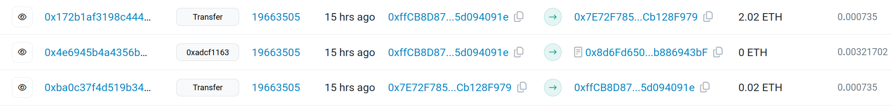

# Example exit queue tickets recovery

This script was used to rescue funds waiting to be withdrawn on the Kiln Onchain V2 Exit Queue to recover $7K worth of ETH from a **compromised wallet**.

### The Problem
- The **compromised wallet** has had it's private key leaked, a malicoius individual set up a bot to monitor for incoming transactions and to steal tokens as soon as they are deposited to the compromised address. 
- To claim the ETH from the exit queue the compromised wallet needs to be seeded with enough ETH to pay for the gas fees (without the bots stealing the ETH as soon as it is deposited). 

The solution is to send transactions to seed + claim + withdraw all in the **same block**. We can do this by sending these transactions as a bundled to the flashbot network using the [ethers-provider-flashbots-bundle](https://www.npmjs.com/package/@flashbots/ethers-provider-bundle) package.

## Transactions 
1. Send funds from `funding_wallet` to `compromised_wallet` to cover gas for claiming + transfering
2. Claim the exit queue ticket from `compromised_wallet` 
3. Transfer claimed ETH tokens from `compromised_wallet` to `ledger_wallet`

## Proof Of Transactions 
The transactions can be seen bundled together in block [19663505](https://etherscan.io/txs?block=19663505&p=4)

### Transaction Hashes
| Transaction                                                            | Hash                                                                                                                                                             |
| -----------                                                            | -----------                                                                                                                                                      |
| Funding `compomised_wallet` using `funding_wallet`                     | [0xba0c37...1da10e](https://etherscan.io/tx/0xba0c37f4d519b34728358ba9a000ad9c69c5fc8f3169609c66b5cc397b1da10e)  |
Claiming the exit ticket to `compromised_wallet`                        | [0x4e6945...013470](https://etherscan.io/tx/0x4e6945b4a4356b21302759c97a96e3a973374d3abc675584657b2ee472013470) |
| Withdrawing ETH from `compromised_wallet` to `ledger_wallet`           | [0x172b1a...5bf065](https://etherscan.io/tx/0x172b1af3198c444e810858bc39388df14b77fa723bec1d57c771dd911a5bf065)  |

### Contracts/Addresses In Play
| Contract/Account Name     | Address                                                                                                               |
| -----------               | -----------                                                                                                           |
| Exit queue contract       | [0x8d6Fd650500f82c7D978a440348e5a9b886943bF](https://etherscan.io/address/0x8d6Fd650500f82c7D978a440348e5a9b886943bF) |
| Compromised Wallet        | [0xffCB8D87dAcc4BDE40Dda52b5a81eB25d094091e](https://etherscan.io/address/0xffCB8D87dAcc4BDE40Dda52b5a81eB25d094091e) |
| Funding Wallet            | [0x7E72F7856465f64908C9a9c000E133ACb128F979](https://etherscan.io/address/0x7E72F7856465f64908C9a9c000E133ACb128F979) |
